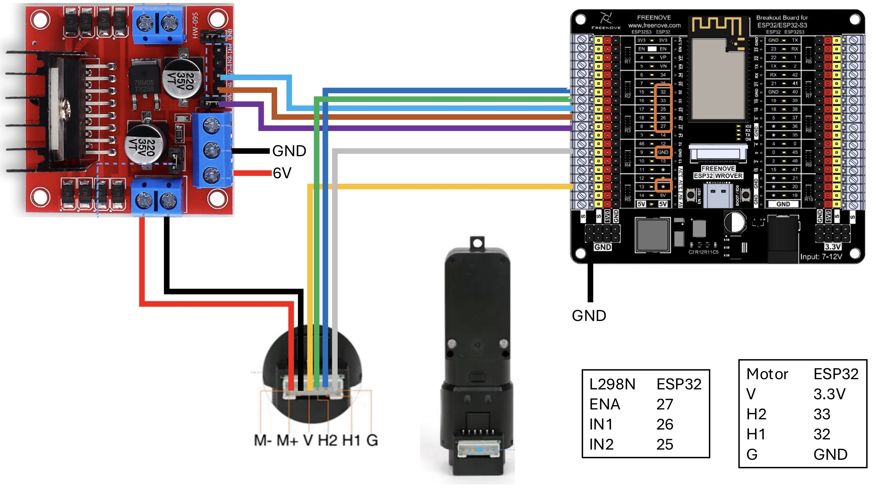

# Open Loop Velocity Control

Fixed PWM output with no feedback. The motor runs at a constant duty cycle regardless of load. Use this sketch to observe how mechanical load reduces motor speed when there is no corrective action.

---

## Download

1. Click the green **`<> Code`** button at the top of this repository
2. Select **Download ZIP**
3. Extract the ZIP to your Arduino sketchbook folder
   - Windows: `Documents\Arduino\`
   - Mac/Linux: `~/Arduino/`
4. Open **`Open_Loop_Velocity.ino`** in Arduino IDE

> **Board package required:** ESP32 by Espressif
> Install via: `File > Preferences > Additional Boards Manager URLs`
> Add: `https://raw.githubusercontent.com/espressif/arduino-esp32/gh-pages/package_esp32_index.json`
> Then: `Tools > Board > Boards Manager` → search **esp32** → Install

---

## Hardware

### Components

- ESP32 Dev Module
- L298N Motor Driver Module
- TT Gear Motor with Quadrature Encoder
- 6–9V external power supply (for motor)
- USB cable (ESP32 to PC)

### Pin Assignments

| Signal | ESP32 GPIO | Connected To |
|--------|-----------|--------------|
| IN1 | GPIO 26 | L298N IN1 — motor direction |
| IN2 | GPIO 25 | L298N IN2 — motor direction |
| ENA | GPIO 27 | L298N ENA — PWM speed control |
| ENC A | GPIO 33 | Encoder channel A |
| ENC B | GPIO 32 | Encoder channel B |
| GND | GND | Common ground — ESP32, L298N, encoder |
| 5V | 5V or Vin | Encoder VCC logic power |
| Motor power | External | 6–9V to L298N VS terminal |

### Wiring Diagram



---

## What This Sketch Does

The motor runs at a fixed PWM duty cycle (default: 150 out of 255). The encoder is read every 100 ms and velocity is calculated as:

```
velocity (counts/sec) = Δ encoder counts ÷ elapsed time (seconds)
```

Two values are streamed to the Serial Plotter:
- `Setpoint` — a flat reference line at your expected no-load speed
- `Velocity` — actual measured motor speed in counts/second

There is **no feedback loop**. If load slows the motor, the PWM output does not change.

---

## Running the Sketch

### 1. Upload

- `Tools > Board` → **ESP32 Dev Module**
- `Tools > Port` → select your ESP32 COM port
- Click **Upload**

### 2. Measure No-Load Speed

Open `Tools > Serial Monitor` at 115200 baud. Let the motor spin for 10 seconds with no load. Note the `Velocity` value — this is your free-run speed.

### 3. Set the Reference Line

Update this line in the sketch to match your measured no-load speed, then re-upload:

```cpp
double velocitySetpoint = 800.0;  // ← change to your measured no-load speed
```

This sets the flat reference line in the Serial Plotter so the speed drop is clearly visible.

### 4. Open Serial Plotter

- Close Serial Monitor
- `Tools > Serial Plotter`
- Set baud rate to **115200**

You will see two traces — a flat setpoint line and the live velocity.

### 5. Apply Load

Press gently on the motor shaft with your finger. Hold for 5 seconds, then release. Watch the velocity trace drop below the setpoint line. Notice the motor does **not** recover while load is applied — there is nothing in the code to correct it.

---

## Adjusting Motor Speed

To change the base PWM duty, edit this line and re-upload:

```cpp
int pwmDuty = 150;  // 0–255 — increase for faster, decrease for slower
```

Start around 120–180 for TT motors. Too low and the motor will not spin consistently. Too high and there is no room to demonstrate the speed drop clearly.

---

## What to Observe

| Condition | Expected behavior |
|-----------|------------------|
| No load | Velocity trace roughly flat near setpoint |
| Load applied | Velocity drops — gap opens below setpoint line |
| Load released | Velocity climbs back — but only because load is gone, not because the code corrected it |

The gap between the setpoint line and the velocity trace while load is applied represents the **uncompensated error**. This is the problem that Activity 2 solves.

---

## Troubleshooting

| Symptom | Likely cause | Fix |
|---------|-------------|-----|
| Motor does not spin | PWM too low, wiring issue | Check IN1/IN2/ENA connections; increase `pwmDuty` |
| Velocity reads zero | Encoder not connected | Check ENC A/B wiring and pullup pins |
| Velocity very noisy | Sample window too short | `VELOCITY_INTERVAL_MS` is 100 — do not reduce |
| Plotter shows one flat line | Baud rate mismatch | Set Serial Plotter to 115200 |
